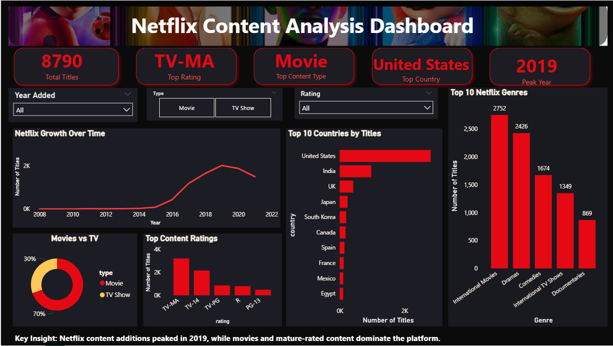

# Netflix Content Analysis Dashboard

## Project Overview

This project focuses on cleaning, exploring, and visualizing a Netflix Movies and TV Shows dataset as part of my Week 1–2 Data Cleaning and Exploratory Data Analysis task for the AnalystLab Africa Data Analytics Internship.

The goal of the project was to transform a raw dataset into a clean, analysis-ready format, perform exploratory data analysis, identify key content patterns, and build a Power BI dashboard to communicate insights clearly.

## Dataset

The dataset contains information about Netflix movies and TV shows, including:

- Title
- Content type
- Director
- Cast
- Country
- Date added
- Release year
- Rating
- Duration
- Genre/category
- Description

Source: Kaggle Netflix Movies and TV Shows Dataset

## Tools Used

- Python
- Pandas
- Google Colab
- Power BI
- Excel

## Data Cleaning Process

The cleaning process included:

- Checking the dataset structure, rows, columns, and data types
- Identifying missing values
- Filling missing values in director, cast, and country with `"Unknown"`
- Removing rows with missing values in date_added, rating, and duration
- Removing duplicate records
- Standardizing text columns by removing extra spaces
- Removing hidden line breaks to make the dataset Power BI-friendly
- Converting `date_added` to a proper date format
- Creating a new `year_added` column for time-based analysis
- Splitting combined genre values for better genre analysis

After cleaning, the dataset contained **8,790 records**.

## Exploratory Data Analysis

The analysis explored:

- Movies vs TV Shows distribution
- Netflix titles added over time
- Top content-producing countries
- Most common content ratings
- Most common genres

## Key Insights

- Movies make up the majority of Netflix titles in the dataset.
- TV-MA is the most common content rating.
- The United States contributes the highest number of titles.
- Netflix content additions peaked in 2019.
- International Movies and Dramas are among the most common genres.

## Dashboard Features

The Power BI dashboard includes:

- KPI cards for total titles, top rating, top content type, top country, and peak year
- Slicers for year added, content type, and rating
- Line chart showing Netflix content growth over time
- Donut chart showing Movies vs TV Shows
- Bar charts for top countries, content ratings, and genres

## Project Files

- `Netflix_Dataset_Dashboard.png` - Power BI dashboard screenshot
- `Netflix_Data_Cleaning_EDA_Analysis.ipynb` - data cleaning and EDA notebook
- `netflix_final_cleaned.csv` - cleaned dataset
- `README.md` - project documentation

## Conclusion

This project strengthened my understanding of data cleaning, exploratory data analysis, and dashboard storytelling. It also helped me gain more hands-on experience with Python/Pandas and Power BI while working with a real-world entertainment dataset.
